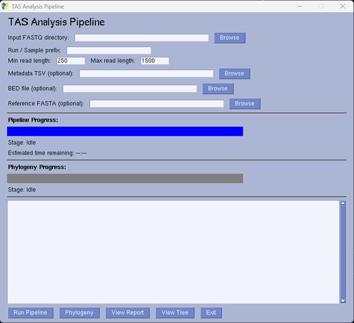

<h1 align="center">
  
    
    
      Targeted Amplicon Sequencing Analysis Pipeline (TAS-AP)
    
  
</h1>

## **Overview** 

TAS-AP is a user-friendly desktop application for analysing Nanopore targeted amplicon sequencing data across any supported primer scheme.
It integrates established ARTIC bioinformatics workflows with Nextstrain phylogenetic analysis, providing an end-to-end solution from read processing to tree visualisation.

The pipeline can be run either as a script or through a graphical user interface (GUI). The graphical user interface (GUI) allows users to customise key pipeline parameters, monitor progress, and access outputs without command-line interaction, while a full command-line mode remains available for advanced users. 

## **Installation**
A pre-compiled Linux x86-64 binary is provided for straightforward setup. Download and extract the tarball, then run the installation script in the terminal as shown below:

<pre> 
  wget https://github.com/Kinene1/TAS-AP/releases/download/v1.0.0/tas_ap_v1.0.0-linux-x86-64-binaries.tar.gz
  tar -xvf tas_ap_v1.0.0-linux-x86-64-binaries.tar.gz
  cd tas_ap_v1.0.0-linux-x86-64-binaries
  bash install.sh
</pre>

The installation script will:
- Create and configure the required Conda environment
- Install all pipeline dependencies
- Set executable permissions
- Generate a desktop launcher for the TAS-AP GUI
Once the installation completes, TAS-AP can be started either from the desktop icon or via the command line.
To launch the GUI, open **Show Applications**, click on “**Type to search**”, and enter **TAS Analysis Pipeline**.
When the application appears in the results, click the icon to start the GUI.

## <h2> Running the TAS-AP remotely </h2>
If you are accessing the application on a remote system, open a terminal and launch the GUI with one of the following commands:
<pre>
  cd tas_ap_v1.0.0-linux-x86-64-binaries
  ./dist/tas_gui  
</pre>
or 
<pre>
  cd tas_ap_v1.0.0-linux-x86-64-binaries
  conda activate tas-pipeline
  Python tas_gui.py
</pre>
This will open the TAS-AP GUI, allowing you to load the required inputs and run the pipeline.

## <h3> Running TAS-AP on a Dataset </h3>

1.	**Select the input FASTQ directory**.

    Navigate to the directory containing the demultiplexed Nanopore reads (the `fastq_pass` directory).  
  	Double-click the directory so that the individual barcode folders are visible, then click OK.  
    
2.	**Enter the Run/Sample prefix**.  
    This is the job name used to label output files. It can be any descriptive name.
  	
3.	**Set amplicon length thresholds**.  
    Specify the minimum and maximum amplicon lengths, allowing a ±200 bp buffer around the expected size.
  
4.	**Provide the `sample_metadata.tsv` file.**  
    This file maps barcodes to sample IDs and must be named exactly `sample_metadata.tsv`. 
  	It should contain the following headers:
    <pre>
  	barcode	sample_id
    barcode01	sample_A
    barcode02	sample_B
    </pre>
    
5.	**Select the primer scheme BED file.** For example: `ps.scheme.bed`.
   
6.	**Select the corresponding reference FASTA file.**  
    This must match the chosen primer scheme (e.g., `ps.reference.fasta`).
  	
7.  **Run the pipeline.**  
    After all inputs are set, click **Run Pipeline** to start the analysis.  
    The GUI will display progress and generate outputs once processing is complete.

<figure>
  
  <figcaption>Figure 1: The GUI of the TAS-AP </figcaption>
</figure>

**ARTIC Processing and report generation**

Running the pipeline executes ARTIC MinION, which generates consensus sequences and a PDF report. The report can be opened directly from the TAS-AP GUI by clicking **View Report**.
Samples marked ✅ Passed in the coverage summary report are automatically selected for downstream phylogenetic analysis.

**Note:** All outputs from the main pipeline are written to the `guppyplex_results` directory.
This directory contains the consensus FASTA files and other inputs required for the phylogeny step.  

8.  **Phylogenetic Analysis Pipeline.**  

Before running the phylogenetic analysis, ensure that the `tree_augur` directory is located in the same parent directory as your `fastq_pass` directory.
The `tree_augur` directory must contain the base alignment and the required **Auspice configuration files**.  

Then:  
-	Click the Phylogeny button in the TAS-AP GUI.
This will run the phylogenetic workflow and start the **Auspice server**.

-	Once the server is running, click **View Tree** to open and explore the interactive phylogeny.

**Remote access**  

If you are running TAS-AP remotely, the browser may not open automatically.  

In this case:
- Navigate to the results directory
- Copy the file `auspice.json` to your local machine.
- Open https://auspice.us/ in a web browser.
- Drag and drop the `auspice.json` file to visualise the tree.  

In the tree, newly generated samples (marked ✅ Passed in the PDF report) are highlighted in grey, allowing them to be distinguished from background taxa.

9.  **Exiting TAS-AP**
    Click Exit in the GUI to close the application.

10.  **Re-running Analyses** 
      
-  Re-run phylogeny only: Click Phylogeny again.   
-  Navigate to the directory containing your `fastq_pass` directory and delete the following output directories:   
     
     <pre> rm -r  results/ guppyplex_results/ </pre>
Then repeat the steps from Section 1 to start a fresh analysis.
