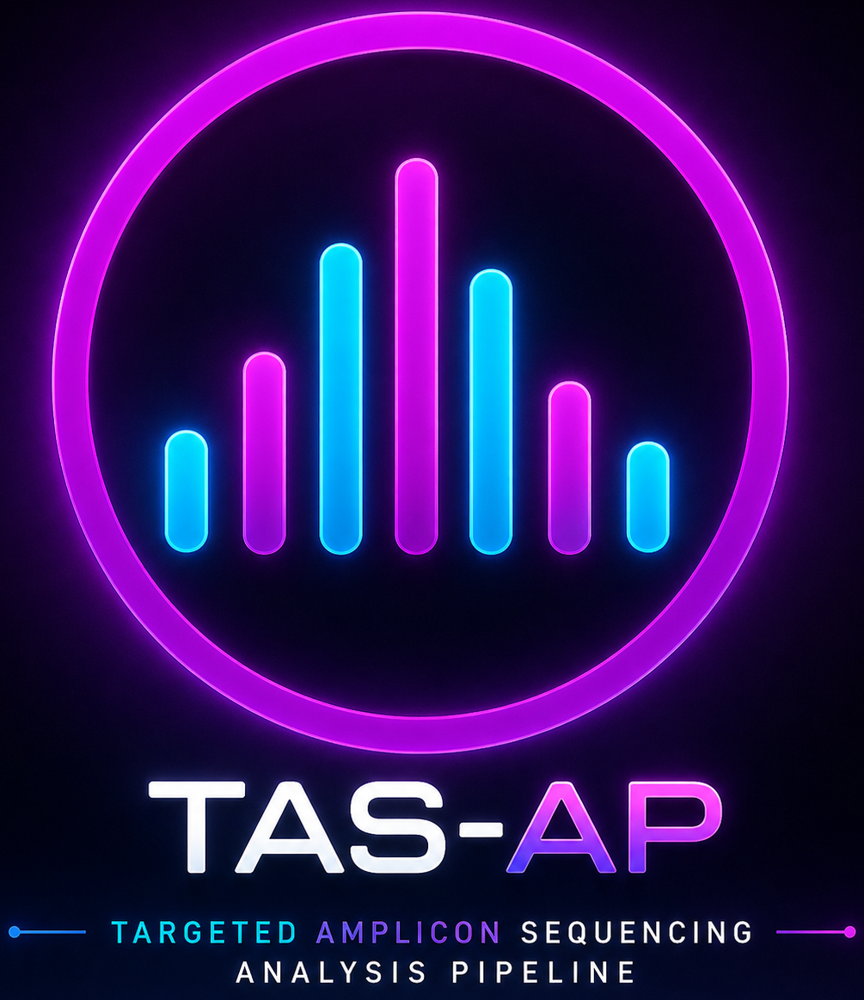

<h1 align="center">
  <div style="display: flex; flex-direction: column; align-items: center; gap: 8px;">
    
    <span>
      Targeted Amplicon Sequencing Analysis Pipeline (TAS-AP)
    </span>
  </div>
</h1>


## **Installation on Windows Subsystem for Linux (WSL 2)**

To install TAS-AP or set up an environment on Windows Subsystem for Linux (WSL 2) with an already installed Miniconda environment, follow these steps:

```
wget https://github.com/Kinene1/TAS-AP/releases/download/v1.0.0/tas_ap_v1.0.0-WSL2_Ubuntu24.tar.gz
tar -xvf tas_ap_v1.0.0-WSL2_Ubuntu24.tar.gz
cd tas_ap_v1.0.0-WSL2_Ubuntu24
bash install.sh
```
The installation script will:

- Create and configure the required Conda environment
- Install all pipeline dependencies
- Set executable permissions

## Running TAS-AP on Windows Subsystem for Linux (WSL 2)
Open a terminal and launch the GUI with the following commands:
```
cd tas_ap_v1.0.0-WSL2_Ubuntu24
conda activate tas-pipeline
Python tas_gui.py
```
## Running TAS-AP on a Dataset
Follow these instructions to run TAS-AP on a dataset via WSL: [Running TAS-AP on a Dataset](README.md)
